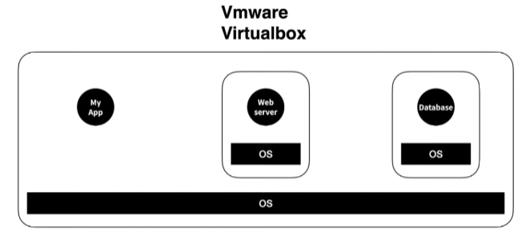
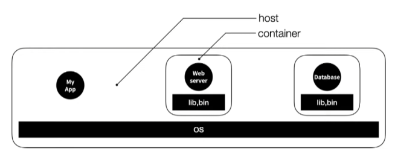

# 도커(Docker)

- 도커는 클라이언트, 서버 환경을 컨테이너(Container)로 관리하는 도구이다.

## 도커 등장 배경

- **도커가 없다면** 각각의 PC에 OS를 설치하고 OS위에 Web server, database, ... 환경을 설치하여야 한다. ex) Web server PC, database PC
  - 문제는 이렇게 하는 경우 비용과 시간이 많이 들게 된다.

- 그래서 하나의 PC의 OS 위에 OS - Web server, OS - database와 같이 Vmware나 Virtualbox를 이용해 가상 환경으로 컨테이너 처럼 사용할 수 있다.
  - 문제는 OS위에 OS를 설치해야 하므로 차지하는 용량이 크고 실행속도도 느리다.

- 위와 같은 문제들을 해결하기 위해 **도커**가 등장했다.
  - 한 대의 PC에서 각각의 앱을 실행 시킨다.
  - 각 앱은 격리된 환경에서 실행된다.
  - 운영체제가 설치된 컴퓨터를 **host**
  - 호스트에서 실행되는 각각 격리된 실행 환경을 **container**

- 각 컨테이너에는 운영체제 전체가 설치된게 아니고 앱을 실행하는 **라이브러리와 실행파일**들만 포함돼있다.
  - 각 컨테이너는 하나의 운영체제를 공유하므로 추가로 설치할 필요도 없고 속도도 빨라진다. 설치 시간과 용량도 아낄 수 있다.
  - Linux OS에는 Container 앱 실행환경(기술)이 존재한다.
  - Container 기술을 도와주는게 **도커**이다.
