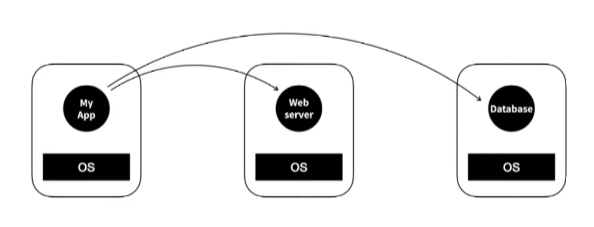
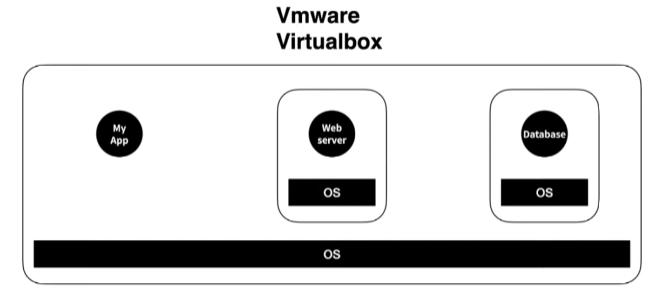
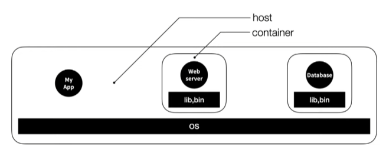
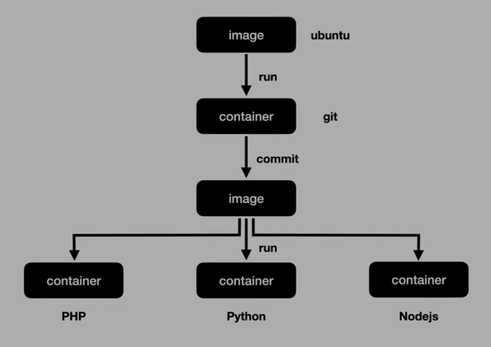

# 도커(Docker)

- 도커는 2013년에 등장한 컨테이너(Container)기반 가상화 도구이다.
- 도커는 리눅스 상에서 컨테이너 방식으로 프로세스를 격리해서 실행하고 관리할 수 있도록 도와주며, 계층화된 파일 시스템에 기반해 효율적으로 이미지(프로세스 실행 환경)을 구축할 수 있게 한다.

## 도커 등장 배경

- **도커가 없다면** 각각의 PC에 OS를 설치하고 OS위에 Web server, database, ... 환경을 설치하여야 한다. ex) Web server PC, database PC
  - 문제는 이렇게 하는 경우 비용과 시간이 많이 들게 된다.



- 그래서 하나의 PC의 OS 위에 OS - Web server, OS - database와 같이 Vmware나 Virtualbox를 이용해 가상 환경으로 컨테이너 처럼 사용할 수 있다.
  - 문제는 OS위에 OS를 설치해야 하므로 차지하는 용량이 크고 실행속도도 느리다.



- 위와 같은 문제들을 해결하기 위해 **도커**가 등장했다.
  - 한 대의 PC에서 각각의 앱을 실행 시킨다.
  - 각 앱은 격리된 환경에서 실행된다.
  - 운영체제가 설치된 컴퓨터를 **host**
  - 호스트에서 실행되는 각각 격리된 실행 환경을 **container**



- 각 컨테이너에는 운영체제 전체가 설치된게 아니고 앱을 실행하는 **라이브러리와 실행파일**들만 포함돼있다.
  - 각 컨테이너는 하나의 운영체제를 공유하므로 추가로 설치할 필요도 없고 속도도 빨라진다. 설치 시간과 용량도 아낄 수 있다.
  - Linux OS에는 Container 앱 실행환경(기술)이 존재한다.
  - Container 기술을 도와주는게 **도커**이다.

## 도커를 사용하는 이유

- 컨테이너는 애플리케이션을 환경에 구애받지 않고 실행하는 기술이다.
- 컨테이너라는 특성으로 구현 환경이 달라 A PC에서 되던 것이 B PC에서 안되는 환경 불일치를 방지한다. -> 어디서나 이미지로 환경을 일치시킨다.
- 컨테이너(환경)의 확장과 축소가 쉽다.
- 인수인계 시 서버의 운영 기록을 인계할 경우 도커 컨테이너 특성으로 시간이 절약된다.

## 도커 용어 및 개념

- Dockerfile
  - Dockerfile은 도커 이미지를 빌드하기 위한 청사진이다.
- Image
  - Image는 도커 컨테이너를 실행하기 위한 템플릿이다.
- Container
  - Container는 격리된 하나의 실행중인 프로세스이다.

## Dockerfile을 작성하는 이유

- Dockerfile은 이미지를 작성할 수 있는 설정 파일이다.
- 예를 들어 Dockerfile이 없다면 기존 도커 우분투 컨테이너 안에 접속해서 python을 설치하고, 다른 우분투 컨테이너에 접속을 해서 nodejs를 설치하는 수동 작업해야 한다.
- 위와 같은 수동 작업을 Dockerfile를 이용하면 자동으로 모든걸 처리하여 이미지로 작성할 수 있다.



Dockerfile 형식

```Dockerfile
FROM <IMAGE_NAME>
RUN <COMMAND>
```

Dockerfile 작성 예시

```Dockerfile
FROM ubuntu:18.04
RUN apt update && apt install -y git
```

이렇게 작성 된 Dockerfile은 Dockerfile이 있는 디렉토리에 존재하는 터미널에서 `docker build -t ubuntu:git`명령어를 이용해 빌드하여 이미지를 만들 수 있다.
참고로 도커 빌드 과정에서 입력이 불가능하기 때문에 `apt install -y git`에서 `-y`를 반드시 해주어야 한다.

각 RUN은 이미지 레이어를 생성시킨다.
레이어마다 docker commit을 실행한다.

```Dockerfile
FROM <IMAGE_NAME>
# 레이어 1
RUN <COMMAND>
# 레이어 2
RUN <COMMAND>
```

## 자주 사용하는 도커 명령어

- `docker images`
  - docker image를 보여준다.
  - ex) `docker images`
- `docker ps`
  - docker container를 보여준다.
  - ex) `docker ps [option]`, `docker ps -a`
- `docker build`
  - Dockerfile을 image로 빌드한다.
  - ex) `docker build -t imagename:tagname .`
- `docker commit`
  - docker container를 이미지로 만든다.
  - ex) `docker commit 기준컨테이너 이미지명:태그명`
- `docker push`
  - docker image를 public(ex; Docker hub), private(개인 서버)하게 업로드 한다.
- `docker pull`
  - 업로드 돼있는 docker image를 다운로드 한다.
  - ex) `docker pull httpd`
- `docker run`
  - docker image를 이용해 container를 생성하고 실행시킨다.
  - ex) `docker run httpd`
- `docker stop`
  - 실행 중인 container를 중지시킨다.
  - ex) `docker stop name`
- `docker start`
  - 중지 중인 container를 실행시킨다.
  - ex) `docker start name`
- `docker rm`
  - container를 삭제한다.
  - ex) `docker rm name`
- `docker rmi`
  - docker image를 삭제한다.
  - ex) `docker rmi httpd`

## 참고 자료

- [Docker docs - https://docs.docker.com/get-started/overview/](https://docs.docker.com/get-started/overview/)
- [도커 소개와 우분투에 도커 CE 설치하기 - https://www.bsidesoft.com/7820](https://www.bsidesoft.com/7820)
- [도커 이미지 빌드와 Dockerfile 기초 - https://www.44bits.io/ko/post/building-docker-image-basic-commit-diff-and-dockerfile](https://www.44bits.io/ko/post/building-docker-image-basic-commit-diff-and-dockerfile)
