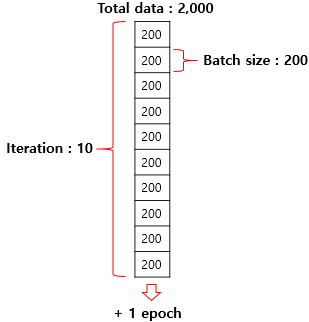

- 에포크(Epoch)

인공 신경망에서 전체 데이터 대해서 순전파와 역전파가 끝난 상태를 말한다.
전체 데이터를 문제지에 비유한다면 문제지(전체 데이터)의 모든 문제를 풀고,(순전파) 정답지로 채점(역전파)하여 문제지에 대한 공부를 끝낸 상태를 말한다.

- 배치 크기(Batch size)

배치 크기는 몇 개의 데이터 단위로 매개변수를 업데이트 하는지를 말한다.
배치 크기를 문제지에 비유한다면 문제지에서 몇 개씩 풀고나서 정답지를 확인하는지를 말한다.
업데이트가 시작되는 시점이 정답지/실제값을 확인하는 시점이다.
실생활 예제를 들면 사람이 2000문제가(전체 데이터) 수록된 문제지의 문제를 200개(배치사이즈)씩 풀고 채점(업데이트)하는것이다.
배치 크기와 배치 수는 다른것인데, 위 예제에 이어서 배치 수는 2000/200 = 10이다. 배치 수는 이터레이션이라고 한다.

- 이터레이션(Iteration)

한 번의 에포크를 끝내기 위해 필요한 배치의 수를 말한다.
또는 한 번의 에포크 내에서 이루어지는 매개변수 업데이트 횟수이기도 하다.
전체 데이터가 2000개, 배치 크기가 200개라면 이터레이션은 10으로 한 번의 에포크에서 10번의 매개변수 업데이트가 이루어진다.

