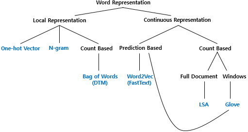

# 단어의 표현

- 국소 표현(Local Representation)
  - 해당 단어 그 자체만 보고, 특정값을 맵핑하여 단어를 표현하는 방법
  - puppy, cute, lovely라는 단어가 있을 때 각 단어를 1, 2, 3과 같은 숫자를 맵핑(mapping)한다.
  - 이산 표현(Discrete Representation)이라고도 한다.
- 분산 표현(Distributed Representation)
  - 해당 단어를 표현하고자 주변을 참고하여 단어를 표현하는 방법
  - puppy라는 단어 근처에 주로 cute, lovely가 자주 등장하므로 puppy는 cute, lovely한 느낌이라고 단어를 정의한다.
  - 연속 표현(Continuous Representation)이라고도 한다.
    > 국소 표현은 단어의 의미, 뉘앙스를 표현할 수 없지만, 분산 표현은 단어의 뉘앙스를 표현할 수 있다.

## 참고 자료

[위키독스 - https://wikidocs.net/31767](https://wikidocs.net/31767)
