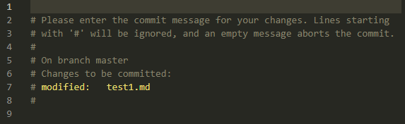
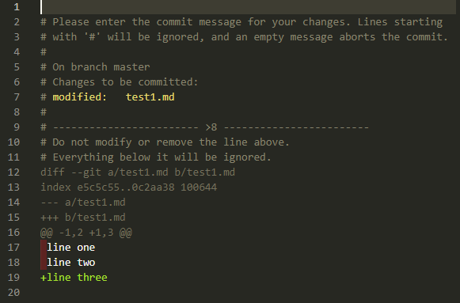

# 깃(git)

git은 프로젝트의 형상 관리를 위한 도구(Version Control System)중 하나이다.
팀 프로젝트 간에 주요하게 사용되는 협업 툴이다.

local과 remote(원격)에서 사용 가능하다.
깃허브라는 내 깃 내역을 업로드할 수 있는 웹 사이트가 있다.

## 깃 워크플로우(git workflow)

- working directory
  - untrack
    - 새로 만들어진 파일이거나 기존에 존해하는 프로젝트에서 깃을 초기화 하는 경우 파일의 정보가 없는 트래킹하지 않은 파일
  - track
    - 한 번이라도 트래킹한 파일
    - unmodified
      - 수정되지 않았다. staging area로 이동할 수 없다.
    - modified
      - 수정됐다. staging area로 이동할 수 있다.
- staging area
  - git add 명령어를 통해 파일이 들어오는 공간
- .git directory
  - git commit 명령어를 통해 파일이 들어오는 공간

## 깃 이그노어(git ignore)

## 깃 명령어

- `git help [command]` - [command]명령어의 설명과 옵션들을 본다.
- `git add [filename]` - 스테이지에 올린다.(Add file contents to the index)
  - 커밋을 할 때 묶인 파일들이 스냅샷으로 저장되는데, 이 파일들을 묶는 작업이 **스테이지에 파일을 올리는 작업**이다.
  - options
    - `git add -u`
      - -u 옵션은 트래킹된 파일중에 변경되거나 삭제된 파일들을 stage로 올린다. 하지만 새로운 파일은 stage에 올라가지 않는다.
- `git commit` - 저장소에 변경 사항을 저장한다.(Record changes to the repository)
  - 게임의 세이브에 해당하는 행동을 git에서 커밋이라 한다. 즉, 언제든 커밋한 시점으로 되돌아 갈 수 있다. 커밋을 하면 staged상태인(추가되거나 변경된) 파일들이 한 **스냅샷으로 기록**된다. 아무 옵션을 주지 않으면 설정해놓은 editor로 변경된 사항들을 확인 할 수 있으며, #은 주석이고 커밋 메시지를 작성하고 editor를 닫으면 커밋이 완료된다.
  - 
  - options
    - `git commit -a`
      - -a 옵션은 변경되거나 삭제된 파일들을 stage로 올린다. 하지만 새로운 파일은 stage에 올라가지 않는다.
      - -a 옵션은 다른 옵션과 함께 사용할 수 있다.
        - ex) `git commit -am "commit message"`
        - ex) `git commit -av "commit message"`
    - `git commit -m "commit message"`
      - -m 옵션은 editor를 열지 않고 전달한 커밋 메시지와 함께 커밋한다.
    - `git commit -v`
      - -v 옵션은 변경된 사항이 있는 경우 editor를 열고 해당하는 사항을 확인한 후 커밋한다.
      - 
- `git push` - 원격 git(ex; github)에 업로드한다.
  - 스테이지와 커밋은 로컬에서만 저장이 된다. 깃허브라는 리모트(원격 서버)에 내 깃 내역을 업로드 한다.
- `git fetch`
- `git pull` - 원격 git의 최신 커밋을 가져온다.
- `git clone` - 원격 git으로부터 다운로드한다.
- `git branch` - 분기한다.
  - `git branch [branchname]` - [branchname]으로 branch를 만든다.
  - `git branch -a` - 전체(로컬, 리모트) 브랜치를 본다.
- `git checkout` - 분기를 이동한다.
- `git reset` - stage에 올라간 파일들을 unstage 상태로 되돌린다.(Reset current HEAD to the specified state)
- `git revert [commit]` 존재하는 커밋을 되돌린다.(Revert some existing commits)
  - commit 기록 값(ex 445a0955)을 커밋하기 이전으로 되돌린다. 변경됐던 값들을 모두 되돌리기 때문에 내용이 필요한 경우 백업을 해놓는것이 좋다.
