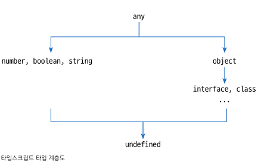

# 타입 주석 (type annotation)

## 타입 주석

```
let 변수이름: 타입 [= 초깃값]
const 변수이름: 타입 = 초깃값
```

```
let n: number = 1;
let s: string = 'hello'
let b: boolean = true // or false
let o: object = {}
let a: any = 1; // any 타입은 number, string, boolean, object, undefined등 모든 타입이 허용된다.
let u: undefined = undefined
u = 1 // Type '1' is not assigned to type 'undefined' 오류 발생
```



## 객체와 인터페이스

인터페이스는 객체의 타입을 정의한다.

```
interface 인터페이스 이름 {
  속성이름[?]: 속성타입[,...]
}
```

인터페이스 속성들을 여러 줄로 표현할 때는 쉼표(,)대신 세미콜론(;)을 구분자로 쓰거나 단순히 줄바꿈을 해도 된다.

```
interface Iperson {
  name: string
  age: number
}

let good: Iperson = {name: 'Shin', age: 24}

let bad1: Iperson = {name: 'Shin'} // age 속성이 없으므로 오류
let bad2: Iperson = {age: 24} // name 속성이 없으므로 오류
let bad3: Iperson = {} // name과 age 속성이 없으므로 오류
let bad4: Iperson = {name: 'Shin', age: 24, etc: true} // etc속성이 있으므로 오류
let bad4: Iperson = {name: 25, age: 'Shin'} // name과 age에 타입이 잘못돼서 오류
```

### 선택 속성 구문

인터페이스 설계 시 있어도 되고 없어도 되는 속성은 **선택 속성**(optional property)으로 만들면 된다.
선택 속성은 속성 이름 뒤에 물음표 기호를 붙여서 만든다.

```
interface Iperson2 {
  name: string
  age: number
  etc?: boolean
}
```

### 익명 인터페이스

interface 키워드와 이름을 생략하고 인터페이스를 만들 수 있습니다.

```
let ai: {
  name: string
  age: number
  etc?: boolean
} = {name: 'Shin', age: 24}
```

또한 익명 인터페이스는 주로 함수를 구현할 때 사용된다.

```
function printMe(me: {name: string, age: number, etc?: boolean}) {
  console.log(
    me.etc ?
      `${me.name} ${me.age} ${me.etc} :
      `${me.name} ${me.age}
  )
}
printMe(ai) // Shin 24
```

자바스크립트에서 함수와 익명 함수를 같이 사용하는 것 처럼 상황에 따라 인터페이스를 선언하거나, 익명 인터페이스를 사용하면 된다.
