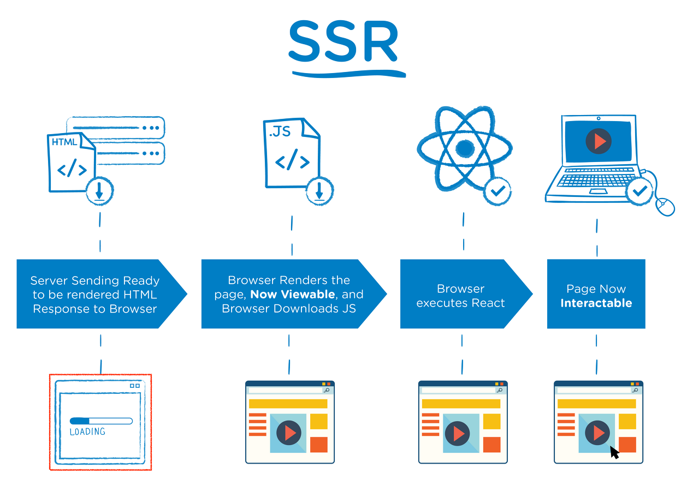

# CSR(Client Side Rendering)과 SSR(Server Side Rendering)

Client와 Server중 어느 쪽(Side)에서 Rendering을 준비하느냐의 차이이다.

## CSR

렌더링이 클라이언트 쪽에서 일어난다. 즉, 서버는 요청받으면 클라이언트에 HTML과 JS를 보내준다.
클라이언트는 그것을 받아 렌더링을 시작한다.
클라이언트 측에서 모든 일을 하는것, 처음에는 화면이 비어있다.

- 장점:
  - 초기 로딩 이후 구동 속도 빠름
  - 서버 측 부하 분산
  - 클라이언트 측에서 연산, 라우팅 등을 모두 처리하기 떄문에 반응속도가 빠르고 UX가 우수함(화면 깜빡임이 없음)
  - TTV와 TTI사이 간극이 없음(동시에 일어남)
- 단점:
  - 초기 로딩 속도 느림
  - SEO에 불리함
- 특징:
  - TTV와 TTI가 동시에 일어난다.

### 작동 순서

1. 웹 사이트 방문
2. 브라우저가 서버에 콘텐츠 요청
3. 서버가 브라우저로 JS 링크가 연결된 빈 뼈대 HTML을 전달
4. 브라우저는 서버에 JS 요청, 다운로드 후 동적 DOM 생성(TTV, TTI)

### 어떻게 웹 페이지를 구현했을 때 CSR이 되나요?

React, Angular, Vue와 같은 프론트 프레임워크를 사용하면 자연스럽게 CSR이 된다.

### CSR 단점 보완 방법

- 초기 로딩 속도 보완
  - code spliting
  - tree-shaking
  - chunk 분리
- SEO 개선
  - pre-rendering
- CSR의 단점을 보완하기 위해 SSR, SSG 도입

## SSR

static 사이트에서 영감을 받음, 서버 측에서 모든 일을 하는것, 서버에서 렌더링이 완료된다.

- 장점:
  - 초기 구동 속도가 빠름
  - SEO에 유리함
- 단점:
  - static 사이트의 문제점인 blinking 문제(다른 페이지로 이동할 때 깜빡이면서 새로고침 되는 문제)
  - 서버 부하가 있음
  - TTV와 TTI사이 간극이 있음(사용자가 화면을 보고 동작을 기대했으나 동작하지 않을 수 있음)
- 특징:
  - TTV가 먼저 일어난 뒤에 TTI가 일어난다.

### 작동 순서

1. 웹 사이트 방문
2. 브라우저가 서버에 콘텐츠 요청
3. 서버가 렌더링 준비를 마친 HTML, JS code를 브라우저에 전달
4. 브라우저에서 HTML 렌더와 JS 로직 연결
   4.1. 브라우저는 HTML 렌더(TTV)
   4.2. JS code 다운로드, HTML에 JS 로직 연결(TTI)

### 언제 SSR을 사용하는것이 적합한가요?

요청할 때 즉시 만들기 때문에 데이터가 달라져서 미리 만들어두기 어려운 페이지에 적합하다.

### 어떻게 웹 페이지를 구현했을 때 SSR이 되나요?

php, jsp등 백엔드 프레임워크를 사용하면 자연스럽게 SSR이 된다.

## SSG(Static Site Generation)

SSR과 차이점은 서버에서 요청 시에 즉시 만드느냐(SSR) 미리 다 만들어놓느냐(SSG)의 차이이다.

### 언제 SSG을 사용하는것이 적합한가요?

미리 다 만들어두기 때문에 바뀔 일이 거의 없는 페이지에 적합하다.

## 랜더링에 대한 추가 개념

### TTV(Time To View)

화면을 볼 수 있는 시간

### TTI(Time To Interact)

화면과 상호작용할 수 있는 시간

## 참고자료

- [SSR과 CSR의 차이 proglish.tistory.com/216](https://proglish.tistory.com/216)
- [[10분 테코톡] 🎨 신세한탄의 CSR&SSR](https://www.youtube.com/watch?v=YuqB8D6eCKE)
